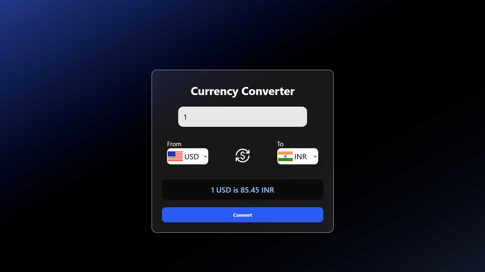

# 💱 Currency Converter

A sleek, real-time **currency converter web app** built with HTML, CSS, and JavaScript using the free and powerful [ExchangeRate.host API](https://exchangerate.host). Supports over **160+ currencies** with country flags, currency codes, and a clean modern UI.

---

## 🌍 Live Demo

> **Hosted Link:** [app link here](#https://currency-converter-snowy-three.vercel.app/)

---

## 🔥 Features

- 🌐 **Live currency conversion** using ExchangeRate.host
- 🏳️‍🌈 **Country flags** and currency codes (e.g., 🇺🇸 USD, 🇯🇵 JPY)
- 🔁 **Swap** currencies with one click
- 🧮 Automatically fetches latest exchange rates
- 🎯 Responsive and easy-to-use interface
- 🚫 Handles invalid conversions and unsupported pairs gracefully

---

## 🖼️ Preview



---

## 🚀 Technologies Used

- HTML5
- TailwindCSS with dark UI
- Vanilla JavaScript
- [ExchangeRate.host API](https://exchangerate.host)
- Flag icons via [flagsapi](https://flagsapi.com)

---

## 🛠️ Setup & Usage

1. **Clone the repository:**
   ```bash
   git clone https://github.com/your-username/currency-converter.git
   ```
2. **Navigate to the project directory:**
   ```bash
   cd currency-converter
   ```
3. **Open `index.html` in your browser to get started.**

---

## 📄 License

This project is licensed under the [MIT License](LICENSE).

---

## 🙌 Acknowledgements

- [ExchangeRate.host](https://exchangerate.host) for free currency data
- [flagsapi.com](https://flagsapi.com) for flag icons

<!-- Add any additional notes or credits here -->
